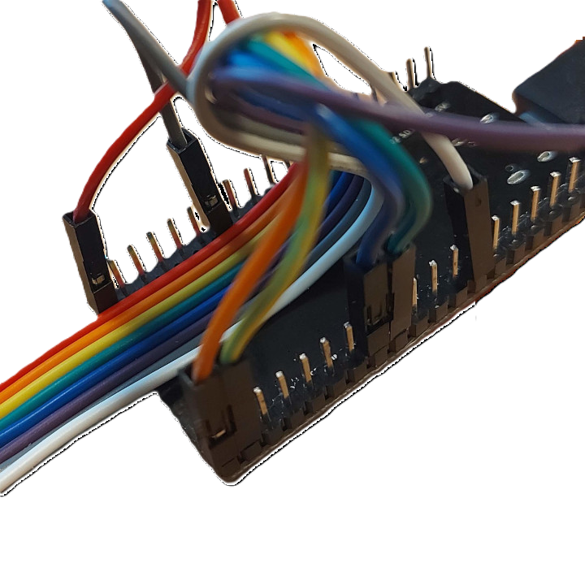

# Kamstrup Multical 21 water meter in Home Assistant (Wireless MBus)


### Features
 * Configuration ready for Home Assistan with MQTT.
 * Support for AES-128 decryption (with vaild key).
 * CRC Check of recived data.
 * Wireless reading of data.
 * Easy to build and configure.


### Parts 
Use these afilliate links to support me!\
[CC1101 Module](https://s.click.aliexpress.com/e/_DembjFr) \
[ESP32 DevKit](https://s.click.aliexpress.com/e/_mPgipQY) \
Some cables

### Wiring

| CC1101 | ESP32 |
| --- | --- |
| VCC | 3V3 |
| GND | GND |
| CSN | P4 |
| MOSI| P23 |
| MISO| P19 |
| SCK | P18 |
| GD0 | P32 |
| GD2 | Not Connected |


 

### Decryption key
First of all you need the decryption key from you water supplier. They normally provide it encrypted, so the first step is to extract the information from the file, and you can use the kem-decrypto.py

The serial number is on the water meter. (typically S/N: XXXXXXXX/A/20, the serial number is the XXXXXXXXX part) and normally provided by the water supplier when you get the key. It could also be a consumer number as it is only used to decrypt the file.

You need [Python](https://www.python.org/downloads/) and to run the program you need the package pycryptodome, so you might also have to install pip, so you can execute this command:

```
pip install pycryptodome
```
Then we are ready to go
```
python kem-decryptor.py filename encryptionkey
```
This should print the following for you (The decrypter is also unzipping if needed):

```
Detected a zip file on input ... extracting
Creating target folder: **************/etc/wmbusmeters.d/
Found meter MC21 (02146C0G8RK)
    number : ********
    serial : ********
    type   : VolumeCold
    driver : multical21
    config : ************
    key    : ********************************

Input to credentials file:
const uint8_t meterId[4] = {0x??, 0x??, 0x??, 0x?? };
const uint8_t key[16] = { 0x??, 0x??, 0x??, 0x??, 0x??, 0x??, 0x??, 0x??, 0x??, 0x??, 0x??, 0x??, 0x??, 0x??, 0x??, 0x?? };
```
The two last lines you should use when creating the credentials file (see below)

The program will also create two files, but the two lines above is all you need from the decryption

### Build and Upload Firmware
* Make sure you have a decryption key for your meter.
* Read the serial number on the meter (typically S/N: XXXXXXXX/A/20, the serial number is the XXXXXXXXX part).
* Rename credentials_template.h to credentials.h and add your details from the previous step
* Update the credential file with you wifi, and details for connecting to MQTT
* Compile and upload:
  - You need [VS Code](https://code.visualstudio.com/) and the [PIO Plugin](https://platformio.org/)
  - Open the project folder with the platformio.ini file (File -> Open Folder...), connect the ESP32 via USB then build and upload with Ctrl+Alt+U.

You will probably need to install a driver to be able to connect to the ESP32, and the cable used must be able to transport data, and not just as a charger. When done flashing, only a charger cable is fine.

A commonly used driver can be found at: [Silicon Labs](https://www.silabs.com/developers/usb-to-uart-bridge-vcp-drivers?tab=downloads)

You can track the work of the ESP32 by connecting to the COM-port. Be aware that the port is using 115200, and not 9600 as default.

### Home Assistant

Setup [MQTT](https://www.home-assistant.io/integrations/mqtt/) if you don't already have it.

You can use [MQTT explorer](https://mqtt-explorer.com/) to verify the packages is being send

Add this to configuration.yaml
```
mqtt:
  sensor:
    - name: "Water Meter Usage"
      unique_id: watermeterusage
      state_topic: "watermeter/0/sensor/mydatajson"
      unit_of_measurement: "m³"
      value_template: "{{ value_json.CurrentValue }}"
      device_class: water
      state_class: total_increasing
      availability:
        - topic: "watermeter/0/online"
          payload_available: "True"
          payload_not_available: "False"
    - name: "Water Meter Month Start Value"
      unique_id: watermeterusagemonth
      state_topic: "watermeter/0/sensor/mydatajson"
      unit_of_measurement: "m³"
      value_template: "{{ value_json.MonthStartValue }}"
      device_class: water
      state_class: total_increasing
    - name: "Water Meter Room Temperature"
      unique_id: watermeterroomtemperature
      state_topic: "watermeter/0/sensor/mydatajson"
      value_template: "{{ value_json.RoomTemp }}"
      unit_of_measurement: "°C"
    - name: "Water Meter Water Temperature"
      unique_id: watertemperature
      state_topic: "watermeter/0/sensor/mydatajson"
      value_template: "{{ value_json.WaterTemp }}"
      unit_of_measurement: "°C"

```

Be aware, that the configuration file must be in UTF-8 due to the special characters.

Device class is introduced in Homeassistant in 2023, so might not work in older versions of HA.

Donation using [Ko-Fi](https://ko-fi.com/patriksretrotech) or [PayPal](https://www.paypal.com/donate/?business=UCTJFD6L7UYFL&no_recurring=0&item_name=Please+support+me%21&currency_code=SEK) are highly appreciated!

This is a based on [chester4444/esp-multical21](https://github.com/chester4444/esp-multical21).
Thanks to chester4444for his effort.
